# Web Fun
## HTML AND CSS

## Objectives

## Outline

* Some HTML
	* Structuring a page
		* `head` and `body`
		* A first message
		* Text everywhere
			* the `p` tag
			* the `section` tag
			* the `article` tag
		* Tags For Everything Else
			* `div` tags
			* `navs`
		* Crazy Tags
* Hosting on GitHub pages 
* Some CSS

## Some HTML

Let's begin our `HTML` and `CSS` journey with a trip to the browser. We'll travel to a little site known as [jsbin.com](jsbin.com).

If we click the far left corner and select `new` we should all have a new document to edit.

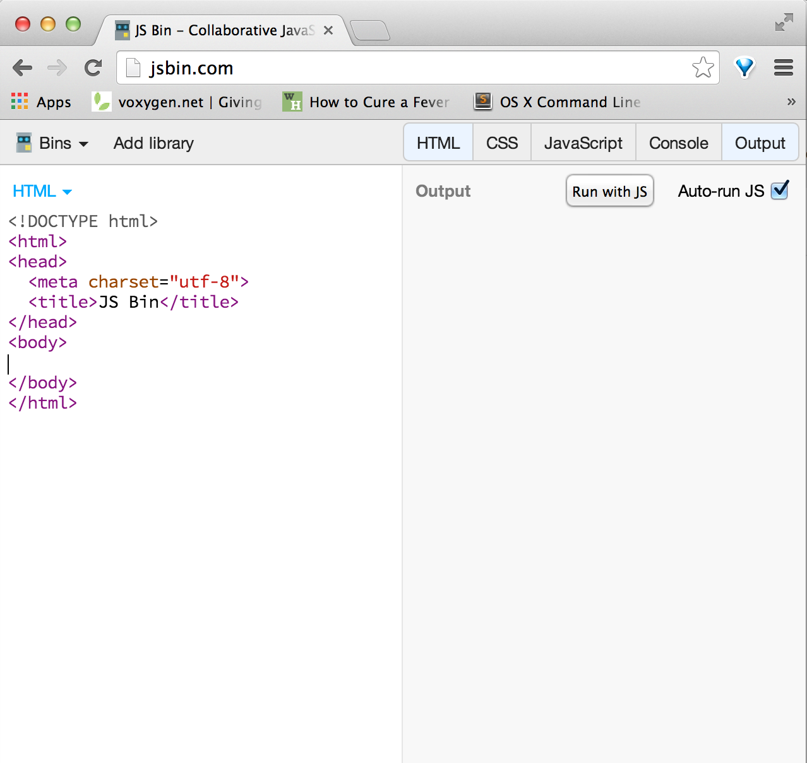

### Head

We have the following code to begin with

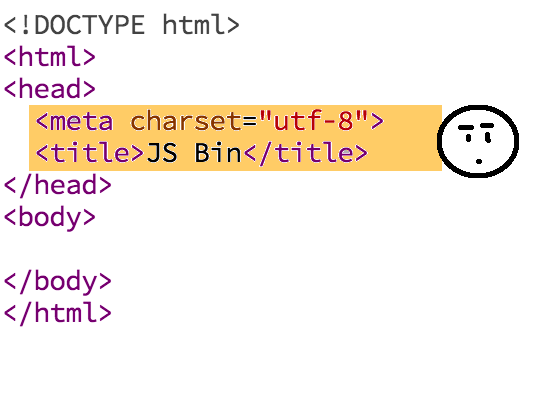

Notice the head of the document is highlighted in orange. It begins with the `<head>` tage and ends with `</head>` tag. It holds all the so called meta-data for our site like the title.

### Body

The body of the document holds all the content for the document.

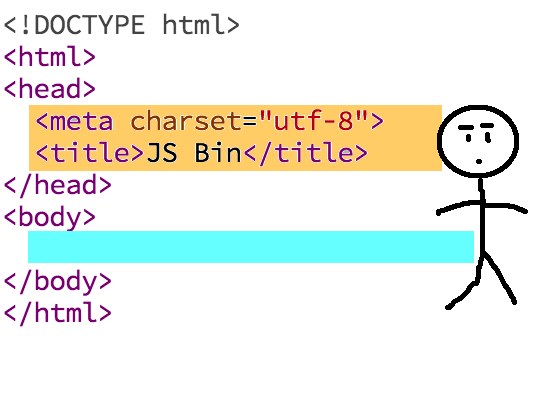

* What goes in the body?

## Exercise - A First Message

A `Hello, World` site.

1. Replace `<title>JS Bin</title>` with your own personal title.
2. Insert `Hello, world!` in the body somewhere.

=====

Here's my version of reality.

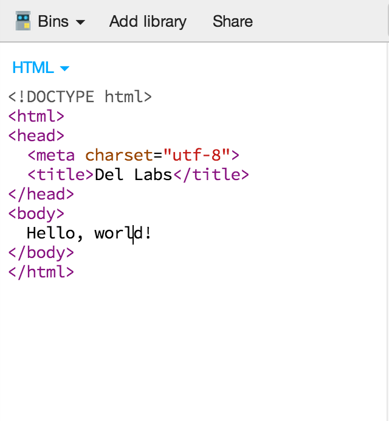

## Text Everywhere

Let's say we had **wayyyyy** more text. Are you imagining this very well? No? Yeah, me too. Let's take another adventure over to the browser to grab "lots of text".

People have needed so called filler text for quite a long time, and it's typically known as `Lorem Ipsum`. It's basically garbled latin. Mainstream vintage? Boring! 

Let's grab some more modern Lorem Ipsum Hipster edition, [hipsum](hipsum.com).

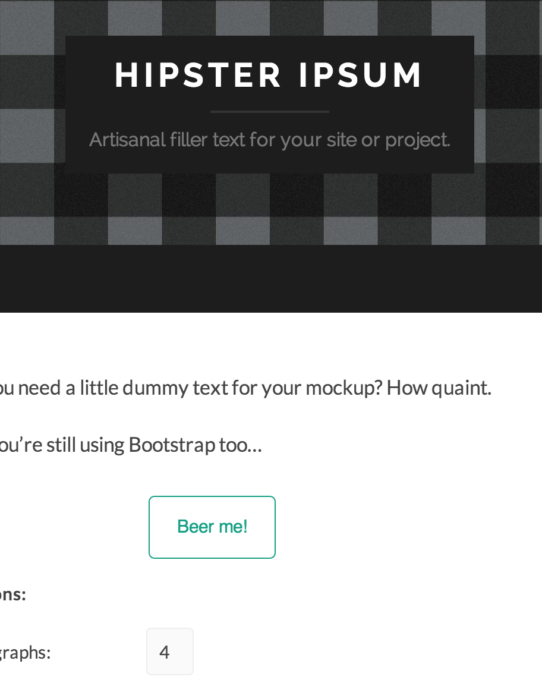</img>

Let's put 4 paragraphs of Hipsum into our app.

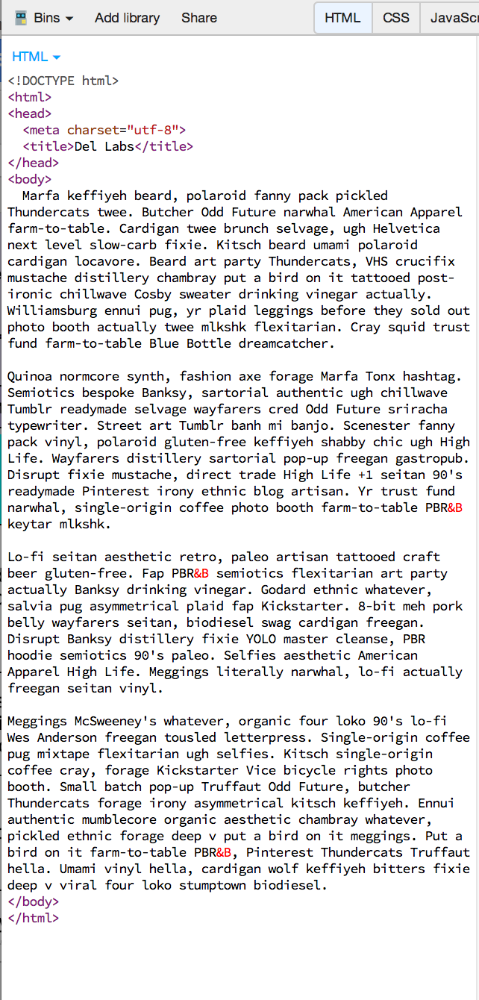

 Now that we've all that done it's no longer cool (hipster rules, not mine). Luckily we can do a little to get our hipness back.
 
### The `
` tag 

Right now our page is full of text that is presented in jumbled mess. We've got to start separating this mess. One of the first things we can do is add `
`, paragraph tag, around every paragraph.

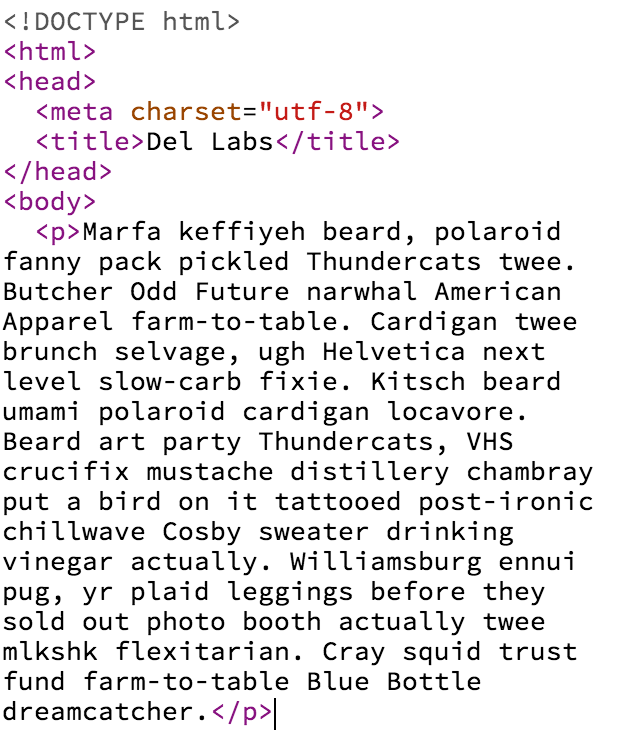

This really separates our paragraphs nicely.

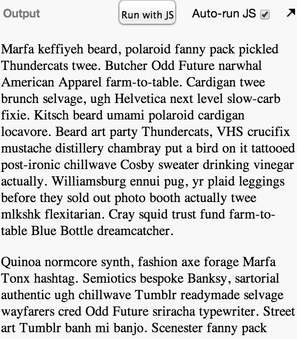

### The Section and Article Tag

The `<section>` tag in html designates a distinct collection of related text to be determined by you. There is also an `<article>` tag, which designates a collection of sections as a complete body of text. You might put multple sections in a single blog post and put an entire blog post in one article tag. This helps when you have multiple blog posts on one page. 

Exercise:

1. Separate your paragraphs into two sections.
2. Put all your text in one article tag.

====

Do you see much of a difference? You shouldn't, but it helps browsers and web scrapers understand the structure of your page.

Here's what we have so far.

	
	<!DOCTYPE html>
	<html>
	<head>
	  <meta charset="utf-8">
	  <title>Del Labs</title>
	</head>
	<body>
	  <article>
	    <section>
     		
Marfa keffiyeh beard, polaroid fanny pack pickled Thundercats twee. Butcher Odd Future narwhal American Apparel farm-to-table. Cardigan twee brunch selvage, ugh Helvetica next level slow-carb fixie. Kitsch beard umami polaroid cardigan locavore. Beard art party Thundercats, VHS crucifix mustache distillery chambray put a bird on it tattooed post-ironic chillwave Cosby sweater drinking vinegar actually. Williamsburg ennui pug, yr plaid leggings before they sold out photo booth actually twee mlkshk flexitarian. Cray squid trust fund farm-to-table Blue Bottle dreamcatcher.

	
			
Quinoa normcore synth, fashion axe forage Marfa Tonx hashtag. Semiotics bespoke Banksy, sartorial authentic ugh chillwave Tumblr readymade selvage wayfarers cred Odd Future sriracha typewriter. Street art Tumblr banh mi banjo. Scenester fanny pack vinyl, polaroid gluten-free keffiyeh shabby chic ugh High Life. Wayfarers distillery sartorial pop-up freegan gastropub. Disrupt fixie mustache, direct trade High Life +1 seitan 90's readymade Pinterest irony ethnic blog artisan. Yr trust fund narwhal, single-origin coffee photo booth farm-to-table PBR&B keytar mlkshk.

	    </section>
	    <section>
	    	
Lo-fi seitan aesthetic retro, paleo artisan tattooed craft beer gluten-free. Fap PBR&B semiotics flexitarian art party actually Banksy drinking vinegar. Godard ethnic whatever, salvia pug asymmetrical plaid fap Kickstarter. 8-bit meh pork belly wayfarers seitan, biodiesel swag cardigan freegan. Disrupt Banksy distillery fixie YOLO master cleanse, PBR hoodie semiotics 90's paleo. Selfies aesthetic American Apparel High Life. Meggings literally narwhal, lo-fi actually freegan seitan vinyl.

	
			
Meggings McSweeney's whatever, organic four loko 90's lo-fi Wes Anderson freegan tousled letterpress. Single-origin coffee pug mixtape flexitarian ugh selfies. Kitsch single-origin coffee cray, forage Kickstarter Vice bicycle rights photo booth. Small batch pop-up Truffaut Odd Future, butcher Thundercats forage irony asymmetrical kitsch keffiyeh. Ennui authentic mumblecore organic aesthetic chambray whatever, pickled ethnic forage deep v put a bird on it meggings. Put a bird on it farm-to-table PBR&B, Pinterest Thundercats Truffaut hella. Umami vinyl hella, cardigan wolf keffiyeh bitters fixie deep v viral four loko stumptown biodiesel.

	    </section>
	  </article>
	</body>
	</html>
	
There are other tags like these, `<aside>`, `<nav>`, `<header>`, and `<footer>`.

## Tags For Everything

We might not always remember when to put something into a section or have an article style document in mind. Is this sooo bad? Honestly, no it isn't.

It only really makes a semantic difference for the most part. For everything else you can just use a `
` tag, which is just a generic tag to help divide content. 

With any element in html you can add attributes to try to destinguish them  specifically, describe groups of elements, or add styling as we will see later.

Let's add some html for a header using a `
` tag.

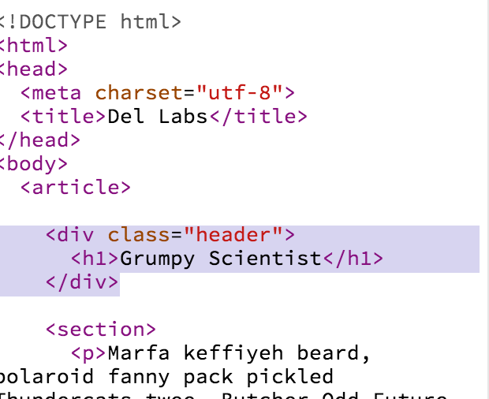

Notice how here we are actually just using the `class="header"` attribute you to denote that this element contains `header` information. This is perfectly fine. Also, note the cool use of `<h1>` tags that denote a heading element, which describes the theme of text to follow. You can use `<h1>` through `<h6>` to denote different headings.

### Exercise

1. Put everything inside the header `div` into another div with a class called `header-content`.
2. Put all the sections inside a `div` with class called `article_content`

### Navs 

We haven't yet used a `nav` but it can useful for collecting links very relavent to our site or to our current document. To create a link we use the following pattern.

	<a href="/your/url/or/path">what you want to display</a>
	

With links you can also reference different parts of the current page, by using a `#`, hash tag, and the `id` of the element. For example, let's give the second section an `id` of `second_section` as follows.

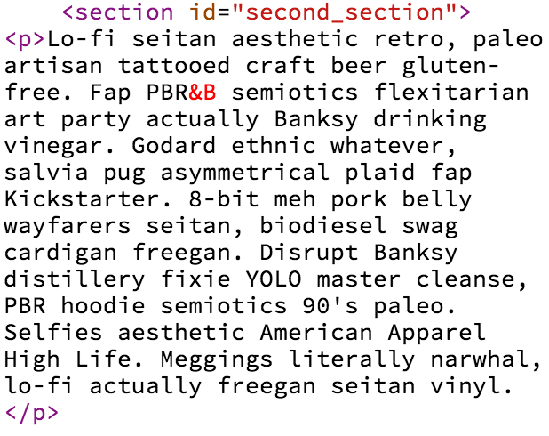

Then we could create a link to it with the following format.

	<a href="#second_section">Section Two</a>
	
We can then place this in a `<nav>` element at the top of the page to help people navigate the document.

### Exercise

1. Add an `id` to the first section and create a link for it at the top of the document.
2. Put the links in a `nav` tag at the top of the page.

### Crazy Tags

Some crazy tags that are no longer used, and serve little purpose beyond humor are the `<blink>` and `<marquee>` tags.

## Hosting on GitHub Pages

### Git and GitHub for Mac Setup

* Sign up for [github](github.com) or sign in. Once signed in or signed up, you should see the following github bootcamp banner:

	* 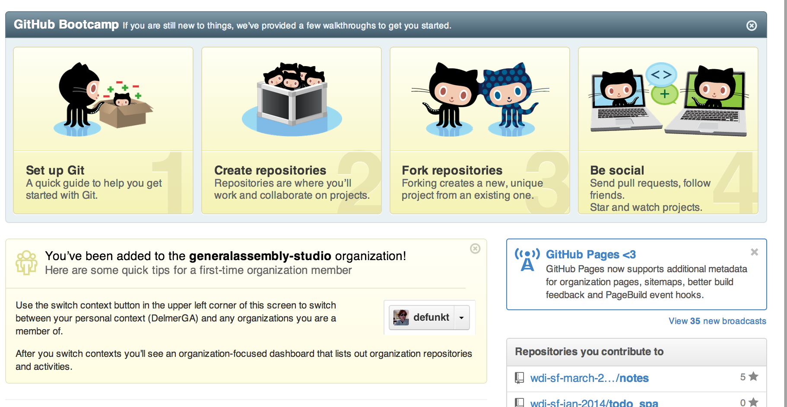

* Click the [`Set up Git`](https://help.github.com/set-up-git-redirect) link, and you should see the following page.

	* 

* Now, you can quickly check to see if `git` is installed by hitting `command-space` (the spotlight in the far right corner of the screen), typing `terminal` and hitting enter.

	* 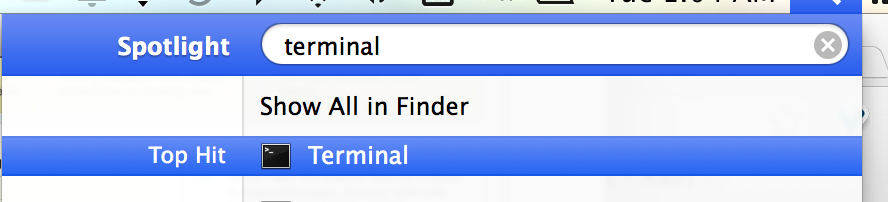

* Next type `git --version` into terminal to see if it is installed

	* 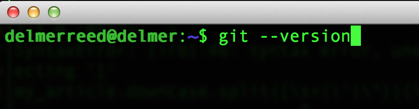

	* If you don't get a version response back we can deal with that by having you go back to the `Set Up Git` page and downloading the latest version.

		* 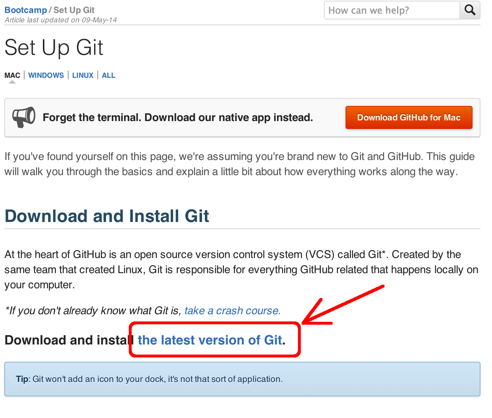
* With git installed, you can [`Download Github for Mac`](https://central.github.com/mac/latest). 
	* 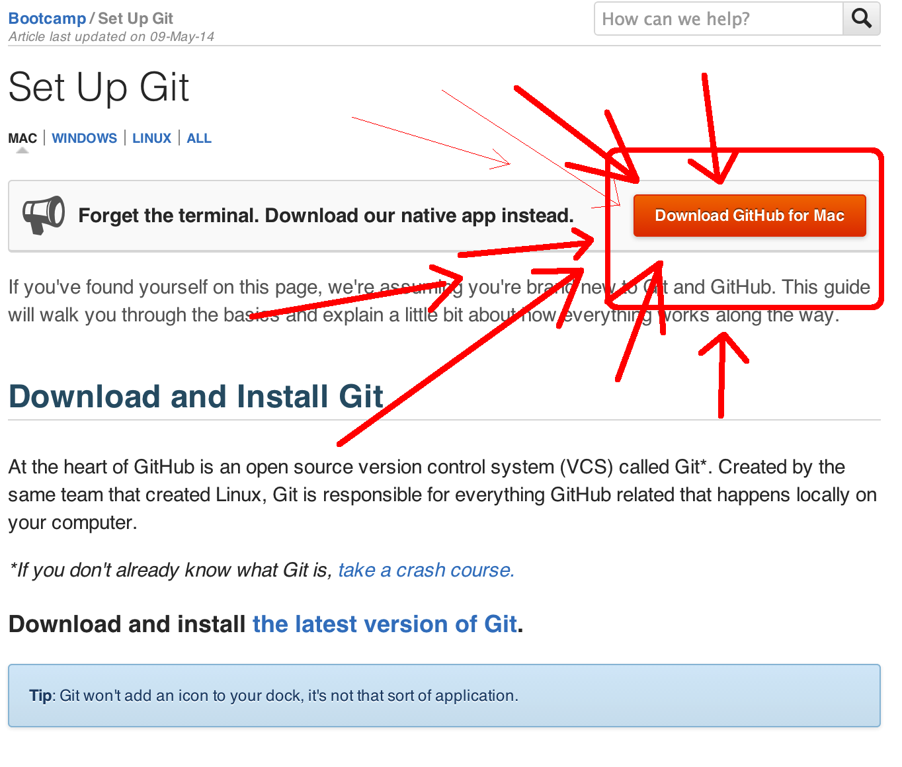
	* 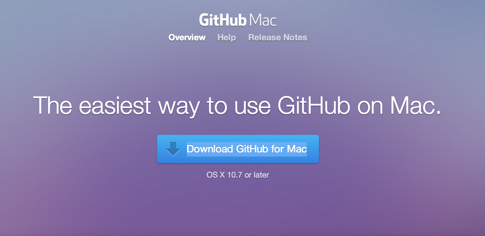

### Creating a Repo 

* Let's create a new repo on Github by clicking the plus in the far righthand corner on GitHub and selecting new repository.

	* 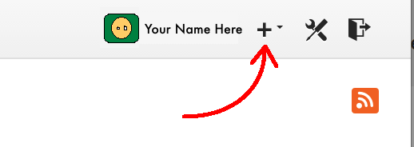
* Then let's name our new repository `about_me` under repository name.
	* 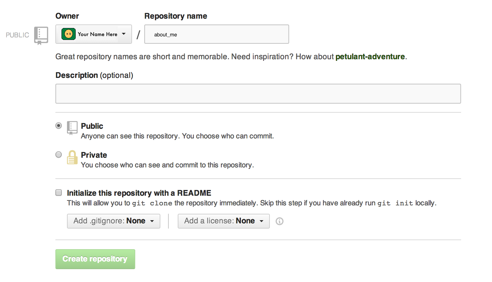

* Click Create

	
